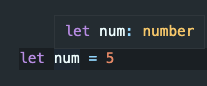
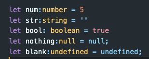
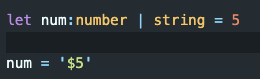
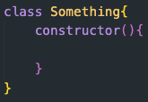

# Chapter 1: TypeScript Types

In the introduction, we covered declaring a variable and return type using a colon. We declared a variable num to a number type:

```
let num: number = 5
```

We also learned that if we omit the number type declaration, TypeScript will use Type inferance to guess what the type will be:



Let's take a look at all the other types!



Now that we learned the basic primary type declaration, lets look into using **_Union Types_**

## Union Types

Say we have a variable:

```
let money:number = 5
```

We declared it to a number type, which means we can't change money to another type. What if money can be either the number 5 or a string of '$5'

We can use a **_Union Type_** to create multiple type possibilities for a variable. To do this, we use a single pipe symbol.



Let's now start taking a look into data types type declarations:

## Array types

It is easy to confuse the yellow text as 'types' and thus confuse it with how classes may look in some text editors. For example:



Don't confuse the class: Array with the typeof array. To declare an array in Typescript we do:


Remember, JS lets us do some weird things with Arrays that we shouldn't do. For example:

```
let arr = [1,'hi', true, null, 10]
```

This works in JS, but arrays should use the same data type throughout its code. This works in JS because everything in JS is an object. TS lets us control this so devs aren't pushing incorrect types into our arrs.
Let's declare an array that will only hold numbers:


You can see now it is an array that will strictly only hold numbers.

Let's look at the different types for Arrays


