# Chapter 1: TypeScript Types

TypeScript is currently in version 5.0 (as of March 16th, 2023)!

Before we get into TypeScript Types, I want to note that the extension for TypeScript files is '.ts'. We will

TypeScript uses colons to do type declarations. If we want to declare a variable in TS, it will look the same as JS.

```
let num = 5
```

But this is just JS, and doesn't specify the type of num. Now, TS is pretty smart and will use something called **_Type Inferance_**.
This means it will assume num is going to be of type num based on the '=5' part. This works fine, but we can also specify the type using colons.

```
let num: number = 5
```

Here we are clearly specifying that num will be a number. If someone goes to reassign num to a string, we get an error **_BEFORE RUN TIME_**

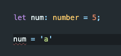

Awesome! Now a developer will know not to reassign num. They even get a cool explanation on why this is an error

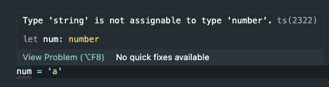

We can now take this a step further with functions. Let's use our previous example of addFive. Let's also specify a return type by adding a type check after the function parameters

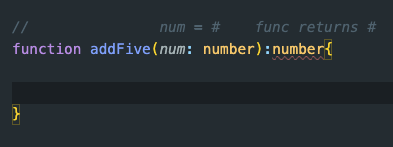

We have added a type to a variable in the parameters called num, and it is assigned to the type 'number'. We have also specfied that our function will return a value 'number'. We are getting an error because we do not have a return type. Let's complete this function!

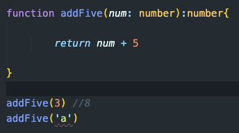

We can see all the errors are handled, the code is cleaner than our JS example, and we as the Developer can see an error before run time when we try to use this function!

In the introduction, we covered declaring a variable and return type using a colon. We declared a variable num to a number type:

```
let num: number = 5
```

We also learned that if we omit the number type declaration, TypeScript will use Type inferance to guess what the type will be:

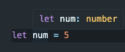

Let's take a look at all the other types!

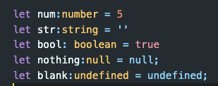

Now that we learned the basic primary type declaration, lets look into using **_Union Types_**

## Union Types

Say we have a variable:

```
let money:number = 5
```

We declared it to a number type, which means we can't change money to another type. What if money can be either the number 5 or a string of '$5'

We can use a **_Union Type_** to create multiple type possibilities for a variable. To do this, we use a single pipe symbol.

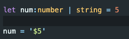

Let's now start taking a look into data types type declarations:

## Array types

It is easy to confuse the yellow text as 'types' and thus confuse it with how classes may look in some text editors. For example:

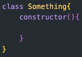

Don't confuse the class: Array with the typeof array. To declare an array in Typescript we do:

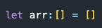

Remember, JS lets us do some weird things with Arrays that we shouldn't do. For example:

```
let arr = [1,'hi', true, null, 10]
```

This works in JS, but arrays should use the same data type throughout its code. This works in JS because everything in JS is an object. TS lets us control this so devs aren't pushing incorrect types into our arrs.
Let's declare an array that will only hold numbers:

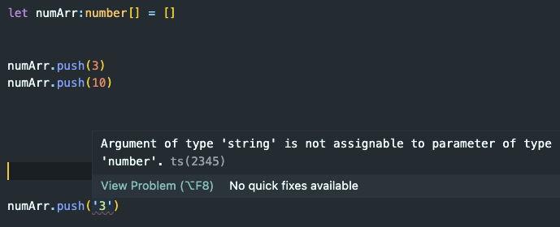

You can see now it is an array that will strictly only hold numbers.

Let's look at the different types for Arrays

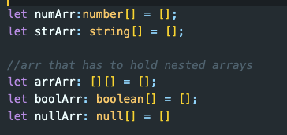

## Intersection Types

In TypeScript, an intersection type allows you to combine multiple types into a single type that has all the properties and methods of each individual type. You can define an intersection type using the & symbol.

Say we want to make an Array that holds either a string or a number,

If we try to use Union, we will get an error:

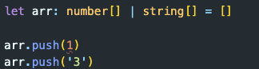

We can use Intersection to combine these into a single type.
Here's an example:

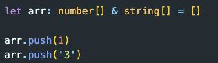

We will touch on more usages of Intersections when we cover objects in TS

## Problem Practice!

Head on over to the problems.ts file in this directory to solve some problems
