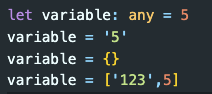

# Chapter 2: Advanced Types and Features

## Type Aliases

TypeScript's type aliases allow developers to create custom names for any type, making it easier to use and more readable. Essentially, a type alias is a new name for a type that already exists in TypeScript.

To create a type alias, you can use the type keyword followed by the name of the alias and the type it represents. Here's an example of creating a type alias for a string:

```typescript
type MyString = string;
```

Now we can use that type in our code:

```typescript
type MyString = string;

function printName(name: MyString) {
  console.log(name);
}

const myName: MyString = "John";
printName(myName);
```

Awesome! Now lets take it to the next level. What if we we want a type to be a specific string? Example, what if I want to make sure the string that is coming in to a function is always of the same letters?

```typescript
type MyName = "Anthony";

let my_name: MyName = "John"; // throws error because 'John' is not of type 'Anthony'
```

pretty cool!!

**_It is convention in TypeScript to make Type Alias start with capital letters using PascalCase._**

## Interfaces

Let's get into working with JavaScript Objects in TypeScript.

an Object in JS will look like this:

```javascript
const obj = {
  name: "Spider-Man",
  superPowers: ["web-slinging", "wall-climbing", "super-strength"],
  loveInterst: "Mary Jane",
};
```

That's a lot of type checking that can go wrong! We can use TypeScript interfaces if we want to add types to the key:value pairs

To do this, we use the `interface` keyword. It is also convention to use PascalCase for the interface name

```typescript
interface Obj {
  name: string;
  superPowers: string[];
  loveInterst: string;
  age: number;
}
```

Now we can declare our superhero obj using this interface:

```typescript
const superHero: Obj = {
  name: "Spider-Man",
  superPowers: ["web-slinging", "wall-climbing", "super-strength"],
  loveInterst: "Mary Jane",
  age: 18,
};
```

This is awesome, because we can resuse this interface type throughout our code. For example, we may want to use dot notation to key into name of superHero. Say we had a function that will take in a superHero Obj and print out its name, we could do something like:

```typescript
function printHeroName(hero: superHero): string {
  console.log(hero.name);
  return hero.name;
}
```

I can better guarantee that the function won't break when a developer tries to pass in an incorrect obj. If they passed in an object that didn't have a "name" keyword in it, this could break so my code is protected!

## Void and Any Types

At this point, let's introduce two new types. TypeScript has the types `any` and `void`.

`void` type lets us declare something that should not exist. For example, in our functions we don't always want to return something. Sure I could leave the function return type as empty but this would inherit the `any` property. Depending on the settings of your TypeScript Compiler (We will learn about this soon), you may be forced to have return types for your functions, even if nothing is to be returned. Void can be used to tell our function that nothing will be returned, and an error is thrown if something is returned.

Let's refactor the printHeroName function from above to not need to return anything:

```typescript
interface Obj {
  name: string;
  superPowers: string[];
  loveInterst: string;
  age: number;
}

const superHero: Obj = {
  name: "Spider-Man",
  superPowers: ["web-slinging", "wall-climbing", "super-strength"],
  loveInterst: "Mary Jane",
  age: 18,
};

function printHeroName(hero: superHero): void {
  console.log(hero.name);
}
```

Void is pretty easy to use, but what is `any`?

`any`, in typescript opens the interpertation to be literally anything. It can be a number, string, undefined, who knows? This is exactly how JavaScript works. As a developer using TypeScript, you should avoid using the any type as much as possible. In this case, why would you even use TypeScript if you can just use JavaScript to do that for you. It is still important to know how to use it, and what it does. Let's take a look:



Notice how I can assign a variable to `any`, and then declare it to the `number` type of 5. Traditionally, TypeScript would rationalzie this any use type inferance to guess all versions of Variable reassignments will be locked at a `number` type. But we locked it to be any so that we can then reassign it to any other version of the type and not get any errors.

Again, this should be avoided so that we don't run into the typical type related bugs we see in JavaScript. Also TypeScript is FTW (For The Win)!

> **This is a good time to take a break! Before moving on, work on the phase1 problems located in phase1.ts**

## Type Guards

In TypeScript, type guards are a way to narrow down the type of a variable based on certain conditions. Type guards can be especially useful when working with union types, which are types that can have multiple possible types.

There are several ways to implement type guards in TypeScript. One way is to use the `typeof` operator to check the type of a variable:

```typescript
function add(a: string | number, b: string | number): string | number {
  if (typeof a === "number" && typeof b === "number") {
    return a + b;
  } else {
    return a.toString() + b.toString();
  }
}

console.log(add(1, 2)); // prints 3
console.log(add("Hello", "World")); // prints "HelloWorld"
```

In this example, the add function takes two parameters a and b, which can be either strings or numbers. We use the typeof operator to check if both parameters are numbers, and if so, we return their sum. Otherwise, we concatenate the two parameters as strings.

Another way to implement type guards is to use the instanceof operator to check if a variable is an instance of a certain class:

```typescript
class Dog {
  bark() {
    console.log("Woof!");
  }
}

class Cat {
  meow() {
    console.log("Meow!");
  }
}

function speak(animal: Dog | Cat) {
  if (animal instanceof Dog) {
    animal.bark();
  } else {
    animal.meow();
  }
}

speak(new Dog()); // prints "Woof!"
speak(new Cat()); // prints "Meow!"
```

In this example, the speak function takes an argument animal, which can be either a Dog or Cat instance. We use the instanceof operator to check if the animal argument is an instance of the Dog class. If so, we call the bark method on the animal argument. Otherwise, we assume it's a Cat instance and call the meow method instead.

Type guards are a powerful feature of TypeScript that can help make your code more robust and maintainable. By narrowing down the type of a variable based on certain conditions, you can write more type-safe and error-free code.

## Assertions

Assertions are a way of telling TypeScript that we know more about the type of a value than it can infer by itself. This can be useful when working with code that has ambiguous types or when dealing with data from external sources that may not be well-typed. In TypeScript, there are two types of assertions: Type assertions and Asserting non-nullability.

A Type assertion is a way of telling TypeScript the type of a value. We use the syntax `<Type>` or `value as Type` to assert the type of a value. For example, if we have a variable <span style='color: rgb(225,120,155)'>x</span> that we know is a string, we can assert its type like this:

```typescript
let x: any = "hello";
let s1: string = <string>x;
let s2: string = x as string;
```

Both `<string>x` and <span style='color: rgb(225,120,155)'>x</span> as string tell TypeScript that <span style='color: rgb(225,120,155)'>x</span> should be treated as a string. This can be useful when working with data from external sources that may not be well-typed or when we want to enforce a specific type in a particular context.

### Asserting Non-nullability

Another type of assertion in TypeScript is the assertion of `non-nullability`. When we declare a variable in TypeScript without initializing it, its type is automatically inferred as `undefined | Type`. This means that the variable can either have a value of `undefined` or the specified type. If we know that the variable will never be `undefined` and we want to avoid `null` or `undefined` exceptions, we can use the `non-null` assertion operator `!`.

```typescript
let x: string | undefined;
let y: string = x!; // non-null assertion
```

In this example, we are asserting that <span style='color: rgb(225,120,155)'>x</span> is not undefined and that it should be treated as a string. This can be useful when working with data that is guaranteed to be defined, such as function parameters.

### Assertion conclusion

---

TypeScript assertions allow developers to provide additional information to the compiler about the type of a value. This can be useful when working with code that has ambiguous types or when dealing with data from external sources that may not be well-typed. By using type assertions and asserting non-nullability, we can ensure that our code is more robust and less prone to runtime errors. Thank you for attending today's lecture on TypeScript Assertions, and I hope you found it informative.

> **This is a good time to take a break!**

## Optional Chaining

Optional chaining is a feature that was introduced in TypeScript 3.7 that allows developers to write cleaner and more concise code when working with nested object structures.

> The Problem with Nested Object Structures

When working with nested object structures, it can be difficult to safely access properties without encountering errors. Consider the following example:

```typescript
const person = {
  name: "John",
  address: {
    street: "123 Main St",
    city: "Anytown",
    state: "CA",
  },
};

const state = person.address.state;
```

In this example, we have a person object with a nested address object. We want to access the state property of the address object. However, if the address object is null or undefined, this code will throw a runtime error.

To avoid this error, we can write code like this:

```typescript
const state = person.address && person.address.state;
```

This code first checks if the address object is defined before attempting to access the state property. However, this can lead to verbose and repetitive code when working with deeply-nested object structures.

Optional chaining provides a more concise and elegant way to access properties in nested object structures. With optional chaining, we can use the ?. operator to safely ac

```typescript
const state = person.address?.state;
```

In this example, the ?. operator ensures that the code does not throw a runtime error if the address property is null or undefined. Instead, it returns undefined if the property does not exist.

We can also chain optional operators together to access properties in deeply-nested object structures.

```typescript
const state = person?.address?.city?.zipCode;
```

In this example, the optional chaining operator is used to safely access the zipCode property of the city object, even if the person or address objects are null or undefined.

## Nullish Coalescing

Nullish coalescing is a feature that was introduced in TypeScript 3.7 that allows developers to write cleaner and more concise code when working with nullish values.

> The Problem with Nullish Values

When working with values that can be null or undefined, it can be difficult to write concise code that handles these cases appropriately. Consider the following example:

```typescript
const name = getUsername() || "Anonymous";
```

In this example, we have a function getUsername() that returns a string or null. We want to assign the result of this function to the name variable, but if the function returns null, we want to use the string "Anonymous" as a default value.

However, this code has a problem. If the getUsername() function returns an empty string or a value that evaluates to false, the || operator will use the default value "Anonymous" instead of the empty string.

`Nullish coalescing` provides a more precise and reliable way to handle nullish values. With `nullish coalescing`, we can use the `??` operator to specify a default value only when the value is null or undefined.

```typescript
const name = getUsername() ?? "Anonymous";
```

In this example, the `??` operator ensures that the default value is only used when the value returned by getUsername() is `null` or `undefined`. If the value is an empty string or a value that evaluates to false, it is not treated as nullish and the empty string will be used.

## Congrats!!!

You have reached your first test!
Head on over to the Test Directory in this directory
