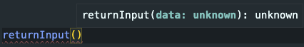
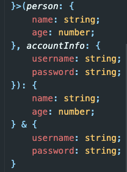
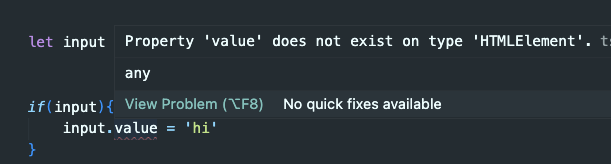

# Chapter 3: Classes and Inheritance

Before we get started with learning classes and inheritance, I want to go over some additional TypeScript features.

Up until now, if we wanted to run a TypeScript file, we would have needed to do:

```
tsc fileNAme.ts
```

to compile our ts file into a js file which we could then run:

```
node fileName.js
```

While it is important to know that TypeScript needs to compile into JavaScript, it doesn't make it any less annoying to have to do that over and over.

First, let's add the ability to run TS files with node. There are a few ways to do this, but we are going to be doing it with `ts-node`.

Let's install it globally running:

```
npm install -g ts-node typescript '@types/node'
```

Now we can run TS files quicker using:

```
ts-node fileName.ts
```

Awesome! So much easier! Again, this helps us for convenience, but it is still important to remember the TypeScript compiler process.

The next thing we want to look at is the tsc config file. Up until now, you might have just been using the default TypeScript rules, or using the ones set up in this repo. TypeScript has a config file that lets you modify the way the TypeScript Compiler will run your code. Think of this like adding mods to Vanilla JavaScript. TypeScript is a mod package, and we can turn certain settings on/off as we see fit.

To view your project's tsc config file run:

```
tsc --init
```

This will create a file called `tsconfig.json`. If you take a look at this, it will be look something like:

```
{
  "compilerOptions": {
    /* Visit https://aka.ms/tsconfig to read more about this file */

    /* Projects */
    // "incremental": true,                              /* Save .tsbuildinfo files to allow for incremental compilation of projects. */
    // "composite": true,                                /* Enable constraints that allow a TypeScript project to be used with project references. */
    // "tsBuildInfoFile": "./.tsbuildinfo",              /* Specify the path to .tsbuildinfo incremental compilation file. */
    // "disableSourceOfProjectReferenceRedirect": true,  /* Disable preferring source files instead of declaration files when referencing composite projects. */
    // "disableSolutionSearching": true,                 /* Opt a project out of multi-project reference checking when editing. */
    // "disableReferencedProjectLoad": true,             /* Reduce the number of projects loaded automatically by TypeScript. */

    /* Language and Environment */
    "target": "ES6",                                  /* Set the JavaScript language version for emitted JavaScript and include compatible library declarations. */
    // "lib": [],                                        /* Specify a set of bundled library declaration files that describe the target runtime environment. */
    // "jsx": "preserve",                                /* Specify what JSX code is generated. */
    // "experimentalDecorators": true,                   /* Enable experimental support for TC39 stage 2 draft decorators. */
    // "emitDecoratorMetadata": true,                    /* Emit design-type metadata for decorated declarations in source files. */
    // "jsxFactory": "",                                 /* Specify the JSX factory function used when targeting React JSX emit, e.g. 'React.createElement' or 'h'. */
    // "jsxFragmentFactory": "",                         /* Specify the JSX Fragment reference used for fragments when targeting React JSX emit e.g. 'React.Fragment' or 'Fragment'. */
    // "jsxImportSource": "",                            /* Specify module specifier used to import the JSX factory functions when using 'jsx: react-jsx*'. */
    // "reactNamespace": "",                             /* Specify the object invoked for 'createElement'. This only applies when targeting 'react' JSX emit. */
    // "noLib": true,                                    /* Disable including any library files, including the default lib.d.ts. */
    // "useDefineForClassFields": true,                  /* Emit ECMAScript-standard-compliant class fields. */
    // "moduleDetection": "auto",                        /* Control what method is used to detect module-format JS files. */

    /* Modules */
    "module": "commonjs",                                /* Specify what module code is generated. */
    // "rootDir": "./dist",                                  /* Specify the root folder within your source files. */
    "moduleResolution": "node",                       /* Specify how TypeScript looks up a file from a given module specifier. */
    // "baseUrl": ".",                                  /* Specify the base directory to resolve non-relative module names. */
    "paths": {
    // "*":["node_modules/*", "src/types/*"]
    },                                      /* Specify a set of entries that re-map imports to additional lookup locations. */
    // "rootDirs": [],                                   /* Allow multiple folders to be treated as one when resolving modules. */
    // "typeRoots": [],                                  /* Specify multiple folders that act like './node_modules/@types'. */
    // "types": [],                                      /* Specify type package names to be included without being referenced in a source file. */
    // "allowUmdGlobalAccess": true,                     /* Allow accessing UMD globals from modules. */
    // "moduleSuffixes": [],                             /* List of file name suffixes to search when resolving a module. */
    // "resolveJsonModule": true,                        /* Enable importing .json files. */
    // "noResolve": true,                                /* Disallow 'import's, 'require's or '<reference>'s from expanding the number of files TypeScript should add to a project. */

    /* JavaScript Support */
    // "allowJs": true,                                  /* Allow JavaScript files to be a part of your program. Use the 'checkJS' option to get errors from these files. */
    // "checkJs": true,                                  /* Enable error reporting in type-checked JavaScript files. */
    // "maxNodeModuleJsDepth": 1,                        /* Specify the maximum folder depth used for checking JavaScript files from 'node_modules'. Only applicable with 'allowJs'. */

    /* Emit */
    // "declaration": true,                              /* Generate .d.ts files from TypeScript and JavaScript files in your project. */
    // "declarationMap": true,                           /* Create sourcemaps for d.ts files. */
    // "emitDeclarationOnly": true,                      /* Only output d.ts files and not JavaScript files. */
    "sourceMap": true,                                /* Create source map files for emitted JavaScript files. */
    // "outFile": "./",                                  /* Specify a file that bundles all outputs into one JavaScript file. If 'declaration' is true, also designates a file that bundles all .d.ts output. */
    "outDir": "./dist",                                   /* Specify an output folder for all emitted files. */
    // "removeComments": true,                           /* Disable emitting comments. */
    // "noEmit": true,                                   /* Disable emitting files from a compilation. */
    // "importHelpers": true,                            /* Allow importing helper functions from tslib once per project, instead of including them per-file. */
    // "importsNotUsedAsValues": "remove",               /* Specify emit/checking behavior for imports that are only used for types. */
    // "downlevelIteration": true,                       /* Emit more compliant, but verbose and less performant JavaScript for iteration. */
    // "sourceRoot": "",                                 /* Specify the root path for debuggers to find the reference source code. */
    // "mapRoot": "",                                    /* Specify the location where debugger should locate map files instead of generated locations. */
    // "inlineSourceMap": true,                          /* Include sourcemap files inside the emitted JavaScript. */
    // "inlineSources": true,                            /* Include source code in the sourcemaps inside the emitted JavaScript. */
    // "emitBOM": true,                                  /* Emit a UTF-8 Byte Order Mark (BOM) in the beginning of output files. */
    // "newLine": "crlf",                                /* Set the newline character for emitting files. */
    // "stripInternal": true,                            /* Disable emitting declarations that have '@internal' in their JSDoc comments. */
    // "noEmitHelpers": true,                            /* Disable generating custom helper functions like '__extends' in compiled output. */
    // "noEmitOnError": true,                            /* Disable emitting files if any type checking errors are reported. */
    // "preserveConstEnums": true,                       /* Disable erasing 'const enum' declarations in generated code. */
    // "declarationDir": "./",                           /* Specify the output directory for generated declaration files. */
    // "preserveValueImports": true,                     /* Preserve unused imported values in the JavaScript output that would otherwise be removed. */

    /* Interop Constraints */
    // "isolatedModules": true,                          /* Ensure that each file can be safely transpiled without relying on other imports. */
    // "allowSyntheticDefaultImports": true,             /* Allow 'import x from y' when a module doesn't have a default export. */
    "esModuleInterop": true,                             /* Emit additional JavaScript to ease support for importing CommonJS modules. This enables 'allowSyntheticDefaultImports' for type compatibility. */
    // "preserveSymlinks": true,                         /* Disable resolving symlinks to their realpath. This correlates to the same flag in node. */
    "forceConsistentCasingInFileNames": true,            /* Ensure that casing is correct in imports. */

    /* Type Checking */
    // "strict": true,                                      /* Enable all strict type-checking options. */
    // "noImplicitAny": true,                            /* Enable error reporting for expressions and declarations with an implied 'any' type. */
    // "strictNullChecks": true,                         /* When type checking, take into account 'null' and 'undefined'. */
    "strictFunctionTypes": true,                      /* When assigning functions, check to ensure parameters and the return values are subtype-compatible. */
    // "strictBindCallApply": true,                      /* Check that the arguments for 'bind', 'call', and 'apply' methods match the original function. */
    // "strictPropertyInitialization": true,             /* Check for class properties that are declared but not set in the constructor. */
    // "noImplicitThis": true,                           /* Enable error reporting when 'this' is given the type 'any'. */
    // "useUnknownInCatchVariables": true,               /* Default catch clause variables as 'unknown' instead of 'any'. */
    // "alwaysStrict": true,                             /* Ensure 'use strict' is always emitted. */
    // "noUnusedLocals": true,                           /* Enable error reporting when local variables aren't read. */
    // "noUnusedParameters": true,                       /* Raise an error when a function parameter isn't read. */
    // "exactOptionalPropertyTypes": true,               /* Interpret optional property types as written, rather than adding 'undefined'. */
    // "noImplicitReturns": true,                        /* Enable error reporting for codepaths that do not explicitly return in a function. */
    // "noFallthroughCasesInSwitch": true,               /* Enable error reporting for fallthrough cases in switch statements. */
    // "noUncheckedIndexedAccess": true,                 /* Add 'undefined' to a type when accessed using an index. */
    // "noImplicitOverride": true,                       /* Ensure overriding members in derived classes are marked with an override modifier. */
    // "noPropertyAccessFromIndexSignature": true,       /* Enforces using indexed accessors for keys declared using an indexed type. */
    // "allowUnusedLabels": true,                        /* Disable error reporting for unused labels. */
    // "allowUnreachableCode": true,                     /* Disable error reporting for unreachable code. */

    /* Completeness */
    // "skipDefaultLibCheck": true,                      /* Skip type checking .d.ts files that are included with TypeScript. */
    "skipLibCheck": true                                 /* Skip type checking all .d.ts files. */
  },
  "include" :[
    "src/**/*.ts",
    "test/**/*.ts"
  ]
}
```

There is a lot in here, so feel free to read into each thing on your own, but for now let us cover the important things in this file.

We can comment out a line if we want to turn off a specific TypeScript feature, or we can comment something in if we want to use it. We can also adjust some of the values if we want to change how our tsc interprets our TS code.

The important things to know:

```
 "target": "ES6",
```

You can change this line to be any specific version of JavaScript you want your TSC to output code as. For this project, I changed it to ES6, but it usally will default to something like ES2015.

```
"outDir": "./dist"
```

Commenting this in will allow our TSC to output JavaScript files into a folder at the root of the project called 'dist'. You can change this to be whatever you want it to be called, or located. It is usually standard practice to keep all your JS files organized

```
"removeComments": true,
```

Commenting this in will remove all the comments made in your TS file from the outputted JS file. You will still have the comments for your TS file, but again, your JS file will not share these comments.

```
"strict": true,
```

This is how we turn or tune the strictness that TypeScript will run on. Typically you should have some sort of strictness for your type checking, as that is the entire point of TypeScript over Vanilla JavaScript. It is up to you and your team to figure out how strict you want it to be. By default, it will be turned on which will be the very strict and encompass all the other strict checks listed below it. For this project, I turned strict off and only turned strictFunctionTypes on to assist with making test-specs (I am the only one working on this project at the time of writing so I know how my code is supposed to run and don't need TypeScript as a team dev tool to be strict).

Lastly, you can add:

```
 "include" :[
    "src/**/*.ts",
    "test/**/*.ts"
  ]
```

as the next key value pair to your tsconfig file (sibling to compileOptions). This will let you run test specs in TypeScript while also checking TypeScript code without having to change every file into JavaScript first. You do not need to add this if you don't plan on doing TypeScript Test-Driven Development.

**Now back to our regularly scheduled topics!**

---

## Abstract Classes and Interfaces

Classes are one of the most important features of TypeScript and they are used to create objects. In TypeScript, classes provide a way to define blueprints for creating objects, which allows you to create multiple instances of a class with the same properties and methods.

Classes in TypeScript look very similar to JavaScript classes. One of the key differences is the need to create type variables before the constructor

Let's first look at a simple Person class in JavaScript. It will just take in a name, age, and have a printName instance method that will log the instance name to the console.

```javascript
class Person {
  constructor(name, age) {
    this.name = name;
    this.age = age;
  }

  printName() {
    console.log(`Hi my name is: ${this.name}`);
  }
}

let newPerson1 = new Person("John Smith", 20);
```

This will look similar to TypeScript version, but notice the type declarations above the constructor

To create a class in TypeScript, you can use the `class` keyword, followed by the name of the class. Here's an example:

```typescript
class Person {
  name: string;
  age: number;

  constructor(name: string, age: number) {
    this.name = name;
    this.age = age;
  }

  printName(): void {
    console.log(`Hi my name is: ${this.name}`);
  }
}

let newPerson1 = new Person("John Smith", 20);

newPerson1.printName();
```

In this example, we've defined a class called 'Person' with two properties: 'name' and 'age'. We've also defined a constructor method that takes in two parameters and assigns them to the corresponding properties of the class. Finally, we've defined a 'printName' instance method that logs a message to the console.

One of the benefits of using classes in TypeScript is that you can define interfaces that describe the shape of the class. For example, we could define an interface for our Person class like this:

```typescript
interface PersonInterface {
  name: string;
  age: number;
  printName(): void;
}

class Person {
  name: string;
  age: number;
  constructor(name: string, age: number) {
    this.name = name;
    this.age = age;
  }

  printName(): void {
    console.log(`Hi my name is: ${this.name}`);
  }
}

let newPerson1: PersonInterface = new Person("John Smith", 20);

newPerson1.printName();
```

## Access Modifiers

Access modifiers are a key feature of object-oriented programming that allow you to control how properties and methods of a class can be accessed.

In TypeScript, there are three access modifiers that can be used to control access to class members:

- Public
- Private
- Protected

Let's take a closer look at each of these access modifiers.

### Public Access Modifier

The `public access modifier` is the default access modifier in TypeScript. It allows class members to be accessed from anywhere, both inside and outside of the class. Here's an example:

```typescript
class Person {
  public name: string;
  public age: number;

  constructor(name: string, age: number) {
    this.name = name;
    this.age = age;
  }

  printName(): void {
    console.log(`Hi my name is: ${this.name}`);
  }
}
```

In this example, all the properties and methods are marked as public. This means they can be accessed from anywhere, including outside of the class. For example:

```typescript
const newPerson = new Person("John Smith", 20);
console.log(newPerson.name); // logs: "John Smith"
newPerson.printName(); // logs: Hi my name is: John Smith
```

### Private Access Modifier

The `private access modifier` restricts access to class members to only within the class. This means that the properties and methods marked as private cannot be accessed from outside the class. Here's an example:

```typescript
class Person {
  private name: string;
  private age: number;

  constructor(name: string, age: number) {
    this.name = name;
    this.age = age;
  }

  printName(): void {
    console.log(`Hi my name is: ${this.name}`);
  }
}

const newPerson = new Person("John Smith", 20);
console.log(newPerson.name); // logs: // ERROR: Property 'name' is private and only accessible within class 'Person'.
```

_P.S, Until July 2022 TypeScript was the only way to create private variable methods for classes. JavaScript added this feature recently, but JavaScript declares private variables using '#'. Make sure not to get them flipped!_

### Protected Access Modifier

The protected access modifier is similar to the private access modifier in that it restricts access to class members to within the class. However, it also allows subclasses to access these members. Here's an example:

```typescript
class Person {
  protected name: string;
  protected age: number;

  constructor(name: string, age: number) {
    this.name = name;
    this.age = age;
  }

  public printName(): void {
    console.log(`Hi my name is: ${this.name}`);
  }
}

class Developer extends Person {
  public printNameAndTitle() {
    console.log(`Hi I am ${this.name}, and I am a developer`);
  }
}

const newPerson = new Person("John Smith", 20);
console.log(newPerson.name); // logs: // ERROR: Property 'name' is protected and only accessible within class 'Person' and its subclasses.
const newDev = new Developer("Jane Doe", 25);
newDev.printName(); // logs "Hi my name is: Jane Doe
newDev.printNameAndTitle(); // logs: Hi I am Jane Doe, and I am a developer
```

** This is a great time to take a break from reading and jump into some code! Head over to the hero.ts file located in the problems directory in this directory.**

## Generics

Let me start by saying that Generics have pretty ehh syntax, and are complicated to understand at first. They have some very specific rules to follow, however, they are extremely useful and you will definitely be using it a lot out in the wild. I would say this section alone may need to be its own section, but let's cover the basics!

> ### What are Generics?

TypeScript's `generics` enable the creation of reusable code components that can be applied to any data type.

Generics allow the creation of functions, classes, and interfaces that can work with a variety of data types. In TypeScript, `generics` are represented by a `type parameter`, **which is a placeholder for the actual data type that will be used at runtime.**

_Generics are similar to templates in other programming languages like C++, Java, and C#. In TypeScript, we use angle brackets (< >) to define a type parameter._

Here's an example:

```typescript
function identity<T>(arg: T): T {
  return arg;
}
```

In the code above, we have a function called identity that takes a single argument of type `T`. The `<T>` in the function signature indicates that `T` is a type parameter. This means that `T` can be any data type.

So let's look at when this may be necessary. First, here is a JavaScript example of a function that may do a different action based on the type if takes. To keep it simple, we will just have it return the data type.

```javascript
function returnInput(data) {
  return data;
}

returnInput("Hey"); // returns a string that says 'hey'
returnInput(1); //returns a number 1
returnInput(true); // returns a boolean true
returnInput([]); //returns an array type that is empty
```

You can see this function has a lot of responsibility in terms of returning different data types. While the function itself doesn't do anything important, this would be really annoying to type in TypeScript using everything we know about TypeScript before the introduction of `generics`;.

Here is what it may look like:

```typescript
function returnInput(
  data: string | number | boolean | array
): string | number | boolean | any[] {
  return data;
}
```

This is super wordy, doesn't even cover the edge cases of when an object is passed in or when a TypeScript array of specific data types such as a string[] may be passed in. Generics allow us to specify what the input will be and use that knowledge to declare the type in the parameter and return fields.

First, let's rebuild our returnInput to use a generic type:

```typescript
function returnInput<genericType>(data: genericType): genericType {
  return data;
}
```

Already much cleaner! But let's also readjust it to follow convention by just changing it to use the `T` for "type"

```typescript
function returnInput<T>(data: T): T {
  return data;
}
```

Now our function has a lot more functionality in terms of handling types without having to use 'any' to cheat our way through TypeScript. So to invoke it we can now do something like:

```typescript
function returnInput<genericType>(data: genericType): genericType {
  return data;
}

returnInput<string>("hello");
returnInput<string[]>(["hi"]);
returnInput<number>(1);
returnInput<boolean>(true);
```

TypeScript will now know what the incoming type is and we can utilize that data.

Here is what TypeScript will say now if we try to call the function without passing in a type or passing in an argument:



While it shows an error since I invoked it with an empty argument, I can now use TypeScript's `type inferance` that we learned about to skip having to specify incoming data during invokation. Our finished function with calls now looks like this:

```typescript
function returnInput<T>(data: T): T {
  return data;
}

returnInput("hello"); //TypeScript will know the type is 'string'
returnInput(["hi"]); //TypeScript will know the type is array of type 'string'
returnInput(1); //TypeScript will know the type is 'number'
returnInput(true); //TypeScript will know the type is 'boolean'
```

In the example above, we're calling the returnInputfunction with a different type arguments. TypeScript will infer the `T`, so the return type of the function is also a of the same type.

> ### Using Generics with Classes

We can also use generics with classes. For example, here's a generic class called Box that can hold any type of value:

```typescript
class Box<T> {
  private value: T;

  constructor(value: T) {
    this.value = value;
  }

  getValue(): T {
    return this.value;
  }
}
```

In the code above, we have a class called Box that has a single type parameter called T. The Box class has a private property called value of type `T`. The constructor takes an argument of type `T` and assigns it to the value property.

The Box class also has a method called getValue that returns the value property.

Here's an example of how we can use the Box class:

```typescript
let box1 = new Box<string>("hello world");
let box2 = new Box<number>(42);

console.log(box1.getValue()); // prints "hello world"
console.log(box2.getValue()); // prints 42
```

In the example above, we're creating two instances of the Box class. The first instance is holding a string value, and the second instance is holding a number value. We're calling the getValue method on both instances to retrieve the values.

> ### Constraining Generics

Sometimes, we want to constrain the type parameter to a specific set of data types. We can use the `extends` keyword to do this. For example, here's a generic function called loggingIdentity that only accepts arguments that have a length property:

```typescript
interface Lengthwise {
  length: number;
}

function loggingIdentity<T extends Lengthwise>(arg: T): T {
  console.log(`Length of ${arg}: ${arg.length}`);
  return arg;
}

loggingIdentity("hello world"); // prints "Length of hello world: 11"
loggingIdentity([1, 2, 3]); // prints "Length of
```

Generics are going to be used heavily when we introduce them in React, but let's also take a look at Generics with plain vanilla HTML and DOM manipulation.

## Multiple Generics

Let's say we want to create a an object that is the spread of two seperate functions:

```typescript
let person = {
  name: "John",
  age: 20,
};

let accountInfo = {
  username: "Johnuser",
  password: "some_password",
};

function makeAccount(person, accountInfo) {
  return {
    ...person,
    ...accountInfo,
  };
}

makeAccount(person, accountInfo);
```

This creates a problem because in our function, the variables person and accountInfo are infered as `any`. We want to avoid using `any`, so we can use generic to combine them. But we also have another problem because person has types of string and number, while accountInfo has types of strings. We can use `multiple generics` to make the correct specification

```typescript
let person = {
  name: "John",
  age: 20,
};

let accountInfo = {
  username: "Johnuser",
  password: "some_password",
};

function makeAccount<T, U>(person: T, accountInfo: U) {
  return {
    ...person,
    ...accountInfo,
  };
}

makeAccount(person, accountInfo);
```

Now I can assign "person" to type T, or whatever the type is when it was passed into our function call. And I can assign "accountInfo" to type U, or whatever the type is when it was passed into our function call. I do not need to specify the return type in this case because TypeScript is able to use `type inferance` in order to see what the new type will be when I return the merged objects, which is the `Union` of `T` and `U`



**Note**: Why did I use `T` and `U`? Convention! Just like in for loops where we start with 'i', then a nested for loop will be 'j' and so on. We start with `T` to make the shorted word for "type" but then we continue in alphabetical order. If we had another argument, we would then use `V` and so on.

## Generics with DOM

In this directory, you will find a file called generics.html. Take a look at the classes and ids for the simple web page. Open the html in a local browser session, so we can take a look at the console as we make some changes to the typescript code. The TypeScript code for this section will be in the file called dom.ts

Before we begin, let's look into having out tsc command run automatically. It would be pretty annoying if we had to keep running tsc on our dom.ts everytime we want to see a change happen in the browser console. To have our tsc command for us automatically we can use tsc's watch flag. Run tsc on the dom.ts file using:

```shell
tsc Chapter3/dom.ts --watch
```

this will run tsc, but leave an event listener on the terminal checking for changes made to the ts file. This way, any changes made in the dom.ts file will auto run tsc and output to our dom.js file for viewing from our html file.

Note: If you see errors on tsc, you may be watching the root which may show errors if you have unsolved errors due to some tests in this project looking for solved problems that you may not have done yet.

Back to our regularly scheduled topic of `generics`!

When we try to run:

```typescript
let input = document.querySelector(".input-box");
```

You will see our TypeScript says our input variable is of type `Element`|`null`. This makes sense, because it is trying to infer that the querySelector may return some sort of element, but it is not sure what OR it may not find anything matching that class, therefore it should return null.

This isn't too helpful for additional code, so this is where `generics` comes into play! Let's add a generic for the type of `HTMLElement`.

```typescript
let input = document.querySelector<HTMLElement>(".input-box");
```

This will now change the type to be more specific on what querySelector grabs, while still keeping its concept of possibly null. This will introduce another error. Let's say we want to change the value of the input. We can run a condition to ensure our input is definitely not null, but we get an error.

Here is the code:

```typescript
window.addEventListener("DOMContentLoaded", () => {
  let input = document.querySelector<HTMLElement>(".input-box");

  if (input) {
    input.value = "hi";
  }
});
```

This is the error:



We get this error because .value doesn't exist on HTMLElement. It exists on HTML Input Elements. So let's change our generic to be HTMLInputElement

updated code:

```typescript
let input = document.querySelector<HTMLInputElement>(".input-box");

if (input) {
  input.value = "hi";
}
```

You should be seeing the value of the input box update each time you save.

Hopefully this helps cover `generics` a bit better before touching it again when we get to TypeScript with React.

Phew that was a lot so let's actually make a project!

Head on over to the todoProject directory in Chapter 3

**todoProject in Production**
