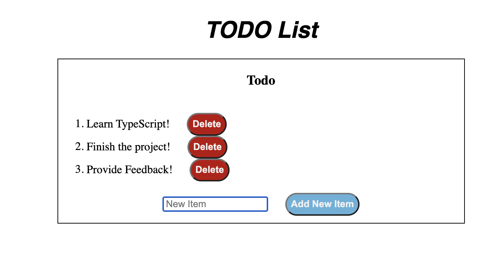

# TODO List

Let's build a todolist using TypeScript!

### Pre-reqs:

    - Feel comfortable with HTML/CSS
    - Feel comfortable with TypeScript Types
    - Understand JavaScript BOM and DOM
    - Have finished Chapter 3 readings

Finished project (You can find the solution in the solution directory)



Let's start out creating a Typescript file in this directory called:
index.ts

> ### Step 1: Setting Up

You'll notice there is an index.html and styles.css file already created for you. Take a look at some of the ids and classes that were used. Additionally, take a look at the way the script tag is set up. We are setting this up using a JS file, so we will have to create that. However, we are going to create that using the TypeScript file.

First, in your index.ts file, add window event listener boilerplate:

```typescript
window.addEventListener("DOMContentLoaded", () => {
  console.log("test");
});
```

To compile TS file and output an index.js file, run:

```shell
tsc index.ts
```

**Note** Make sure you cd into the todoProject directory before running this command.

You should now see an output index.js file within the todoProject directory

Open the index.html file in the browser and open the dev tools. In the console, you should see 'test' printed out if everything is set up correctly.

It is VERRY annoying having to run 'tsc fileName.ts' everytime we want to see a change in the browser. So let's put a watch on this.

Run:

```shell
tsc index.ts -w
```

the -w flag stands for watch. You can also do --watch

This will keep the terminal listening to our ts file and run the tsc command everytime we save our file. Now we should be able to delete the console.log in the TS file and you will see it disappear from the browser if everything is set up. MAGIC!

> ### STEP 2: Querying Elements

Inside the window's event listener we will be querying for 3 elements.

- Use document.querySelector to grab the #add-button. Store it in a variable called addButton
- Use document.querySelector to grab the #ordered-list. Store it in a variable called list
- Use document.querySelector to grab the #input-item. Store it in a variable called inputField

Hint : use generics!

Note: Because we built addButton and inputField directly into our HTML, we know this is always going to show up by the time this eventListener is triggered. If you hover over the variables you will see it is either some sort of HTML type | null. For the addButton and inputField we can add a non-null assertion operator by adding an `!` at the end of the line.

Example for how #add-button should look like:

```typescript
const addButton = document.querySelector<HTMLButtonElement>("#add-button")!;
```

- Now create a variable using let declaration and set it to point to the inputField's value

> ### Step 3: Function to Make List Item

We need to make a function that will take in the text of the inputField value. This function will output an HTML list element.

Inside the function:

- create a new document list element
  - give this a className of 'list-item';
  - give it an innerText of function's parameter variable
- create a new document button element
  - give the button an innerText of 'Delete'
  - give the button a className of 'delete-button'
  - add an eventListner to this button, checking for 'clicks'
    - inside the eventListener, grab the parentElement of the current delete button. Then remove that child from the list
      HINT: You may need to use optional chaining since list may or may not be null at this point
- append the newly created button element to the newly created list item
- return the newly created list item

> ### Step 4: Input Event Listener

Under the function created in step 3, lets create 2 event listeners.

The first event listener should be on the inputField variable. We should be checking for k press. Remember to pass in an 'e' variable to check for events:

example:

```typescript
inputField.addEventListener("keypress", () => {});
```

Inside the event listener:

- Reassign he value of newText to the value of the inputField
- if the key pressed is "Enter"

  - if newText is empty or starts with blank spaces

    - change the inputField's placeholde to say 'Please Enter Text'
    - change style for inputField:
      Hint: use setAttribute like this:

    ```typescript
    inputField.setAttribute(
      "style",
      "outline-color:red; border: 2px solid red"
    );
    ```

  - if newText is not empty and does not start with blank spaces
    - check to make sure newText is not equal to ''
      - if it isn't, change inputField's style to be blank (this will reset the validation style if they made an error previously)
    - set the inputField value back to empty string
    - store the value of invoking our function from step 3 with newText into a variable
    - if list is not null, append the new list item to list (hint: use optional chaining)
    - set the newText variable back to blank string

At this point you should be able to add and delete items using your keyboard! give it a shot and check for the following:

1. User can not submit a blank input
2. User can not submit anything that starts with spaces
3. User can press the delete button to delete the selected item

If everthing looks good, time to finish it up!

> ### Step 5: Add Button Event Listner

Make an event listener, similar to step 4 for the addButton variable.
Inside this listener we will basically be using the same logic from step4 that allowed us to create a list item on enter.

- Reassign newText to be equal to inputField's value
- if newText is empty or starts with empty spaces
  - set inputField's placeholder to say "Please Enter Text"
  - set inputField's style to have a red outline color, and a border that is solid, 2px thick, and red
- if the newText is acceptable
  - check that newText is not equal to ''
    - if it isn't set the inputField style to ''
  - make a new list item using newText
  - append the newly created list item to the list variable
  - change the inputField value to ''
  - change newText to ''

Test out the add item button!

## Celebrate because you just made your first project in TypeScript!!
