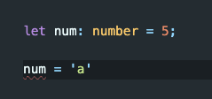
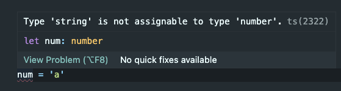

# Introduction: TypeScript

## What is it?

TypeScript is a super set of JavaScript. This means it encapsulates JavaScript so it can do everything JavaScript can do, but it also has TypeScript specific things it can do on top of the JS syntax. The biggest thing being type checking.

## Why is it useful?

TypeScript mainly benefits developers, as it helps them create better code that is strictly used the way it is intended. While this may increase the time needed to develop, it can decrease the amount of time debugging and thus create better quality projects for end-users.

## Example of why?

Say you had a function that will add Five to a single number that is passed in.

We can create a function that looks something like this in JS:

```
function addFive(num){
    return num + 5
}

addFive(3) // 8
```

This is all fine and dandy, however, what would happen a developer were to try and pass in a string?

```
addFive('a') // 'a5'
```

You can see our function will still not crash, but it is outputting something that we do not intend. It is outputting a string, and definitely not doing a mathematical equation to add 5.

In JS we could probably fix this up by changing the function to look something like this:

```
function addFive(num) {
    if (typeof num !== 'number') {
        throw new Error('num must be a number')
    } else {
        return num + 5
    }
}

addFive(3) // 8
addFive('a') // Error: num must be a number
```

This is much better code. We have a function with a good naming, it has some type checking, and it works as intended. Cool! But the issue with this in JS is there is no way, as a developer, to know I will get that error when passing in a string until I either:

1. Look at the function and follow it through.
2. Run Node and see the output in the terminal

In this example, it is really easy to visualize and follow code, especially with the good naming. But if this project gets any bigger, more devs may start joining, and it can clearly become a mess. You may have already seen this when working on a group project and some members use naming conventions that don't make sense to you (but it does to them) and then you have to try and follow their code to see what is doing. Then you litter the codespace with console.logs until you know what you can and can't do and what the expected output is from their function. This is where TypeScript comes in handy!

## Enter TypeScript

TypeScript is currently in version 5.0 (as of March 16th, 2023)!

TypeScript uses colons to do type declarations. If we want to declare a variable in TS, it will look the same as JS.

```
let num = 5
```

But this is just JS, and doesn't specify the type of num. Now, TS is pretty smart and will use something called **_Type Inferance_**.
This means it will assume num is going to be of type num based on the '=5' part. This works fine, but we can also specify the type using colons.

```
let num: number = 5
```

Here we are clearly specifying that num will be a number. If someone goes to reassign num to a string, we get an error **_BEFORE RUN TIME_**



Awesome! Now a developer will know not to reassign num. They even get a cool explanation on why this is an error



We can now take this a step further with functions. Let's use our previous example of addFive. Let's also specify a return type by adding a type check after the function parameters


We have added a type to a variable in the parameters called num, and it is assigned to the type 'number'. We have also specfied that our function will return a value 'number'. We are getting an error because we do not have a return type. Let's complete this function!


We can see all the errors are handled, the code is cleaner than our JS example, and we as the Developer can see an error before run time when we try to use this function!

## Summary

We learned:

- What Typescript is
- Why it is useful
- How to declare a variable type
- How to declare a return type for a function

## Coming up Next...

In the Chapter1 md File, you will be learning the different types
